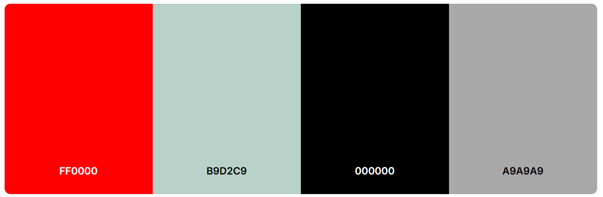

# Battle of Emerging Rock Bands 2025 (UK)

This is where guitars wail, amps crackle and drummers hit harder than your morning coffee. It’s not just a competition – it’s a **rock ‘n roll battlefield** where the loudest, most electrifying, emerging rock bands fight for glory.

## 1. Introduction

The Battle of Emerging Rock Bands 2025 (UK) website has been designed to allow users the opportunity of discovering new bands and their music, in a fun and interative way. By using a voting system, users are encouraged to watch at least 4 bands before they can either run the programme again or go and find more music by the bands they have just watched and listened to.

## 2. Aim and Purpose of the site

The aim and purpose of this website is to expose users to music that they may not heard before as well as provide an opportunity to interact with the website. Up until now (before the launch of this wwebsite) fans would simply go to the different Independant Festval websites, based in the UK for 2025, to see the line-up. Although these websites are informative, they are often just a list of bands and artists that mean the user would need to go and do their own research before the festival. 

By engaging with this website, users will come across bands and artists that they have not heard of as the whole point of the Independant Emerging Rock and Metal Festivals is to showcase up-and-coming new talent.

## 3. Target Audience

The target Audience for this website are fellow rock and metal heads. More specifically people who enjoy going to independant rock and metal festivals based in Great Britain that showcase emerging British bands and artists.

## 4. User's Stories

- As a user I want to 

## 5. Goals

To create a website that is visually appealing, enjoyable to engage with and simple to use so as not to detract from the aim and objective of the website: to discover new music.

## 6. Planning and Development

The idea came about during my initial meeting with my Mentor, Richard Wells, when discussing the type of interactivity I found lacking within my favourite musical taste and the type of interactivity I would enjoy using as I am not a game player.

### 6.1 Wire Frames

### 6.2 Colour Pallet

The colour palettet chosen is the typical colour scheme of the rock and metal scene: red , white and black. However, I change the 'white' for a softer shade of light grey that isn't so stark on the eyes and doesn't cause blurring and bleeding into the black or red. The colours chosen were:

I found the colour using [coolors.co](https://coolors.co/) website.

I also included the dark grey dor the Navbar to make it stand out againt the black background.

### 6.3 Typography

For ease and simplicity I chose Geist Mono with a monospaced appearance, throughout, for the typography as found on [Google Fonts](https://fonts.google.com/). AS the designer I prefer this text for it's simplicity and "old school" typwritter style effect, it is easy to read and nostalgic quality:

## 7. Features

## 8. Testing and Debugging

Please refer to the [TESTING.md](TESTING.md) and Debugging *markdown* file.

## 9. Deployment
 
 Deployment was done early following on from lessons and guidance in a Code Institute Software Development course. At the time of writing there had been **insert number here** deployments.

## 10. Future Features

## 11. Conclusion

## 12. Credits and Acknowledgements

          
