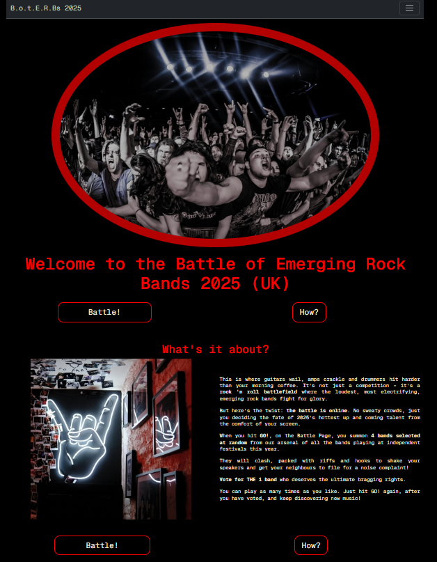
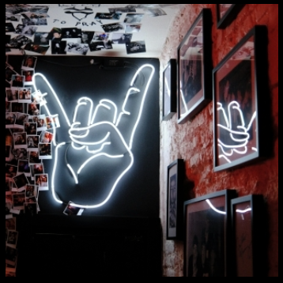
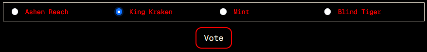
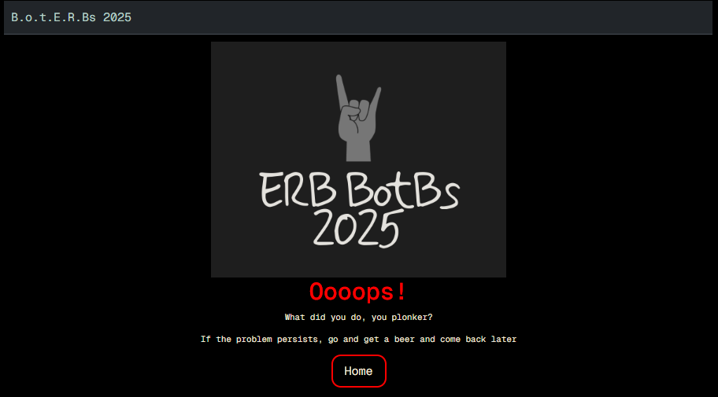

# Battle of Emerging Rock Bands 2025 (UK)

## 1. Introduction

The Battle of Emerging Rock Bands 2025 (UK) website has been designed to allow users the opportunity of discovering new bands and their music, in a fun and interactive way. By using a voting system, users are encouraged to watch 4 bands and vote for the one that they liked the most. The idea is to make the user think about the music they have listened to before going off to find more music by the bands they have just see and heard. By actively engaging in the process there is greater chance of the music being reached by users who are searching to discover new music.

## 2. Aim and Purpose of the site

The aim and purpose of this website is to expose users to music that they may not have heard before as well as provide an opportunity to interact with the website. Up until now (before the launch of this website) fans would simply go to the different Independent Festival websites, based in the UK for 2025, to see the line-up. Although these websites are informative, they are often just a list of bands and artists that mean the user would need to go and do their own research before the festival. For the most part this is often not done, and the fans would wait to hear the bands at festivals for the first time. However, by providing a platform to discover the music, before the festivals, fans may be encouraged to go and listen to more music by the artists that they have been introduced to.

The whole point of the Independent Emerging Rock and Metal Festivals is to showcase up-and-coming new talent. Therefore, this website serves to add value to the genre by offering a fun and engaging way to discover new music.

## 3. Target Audience

The target Audience for this website are fellow rock and metal heads and fans. More specifically people who enjoy going to independent rock and metal festivals, based in Great Britain, that showcase emerging British bands and artists.

## 4. User's Stories

- As a user I want to discover new music (must-have)
- As a user I want to be entertained (must-have)
- As a user I want to have fun while discovering new music (must-Have)
- As a user I want to do all this simply and without additional and unnecessary navigation (must-have)
- As a user I want to have a positive emotional experience (should-have)
- As a user I want to be able to find out which festivals the different bands are playing at (could-have)
- As a user I want to be able to select only the bands that are playing at a particular festival (could-have)

## 5. Goals

To create a website that is visually appealing, enjoyable to engage with, light-hearted and simple to use so as not to detract from the aim and objective of the website: to discover new music. But most of all, to be entertaining.

## 6. Planning and Development

The idea came about during my initial meeting with my Mentor, Richard Wells, when discussing the type of interactivity, I found lacking within my favourite musical taste and the type of interactivity I would enjoy using. As I am not a game player, I needed to come up with an idea that I would enjoy using.

### 6.1 Wire Frames

I decided to build the website from a mobile first perspective, with a width of 320px, so that I would only need to scale up for responsiveness. This resulted in fewer media queries for scaling and styling elements and meant that I only had to focus on styles once, without the complexity of issues I had in project one.

I played around a lot with the initial wireframe to try and design the website to make it as appealing as possible with the end user in mind. I continued to adapt the wireframe as I went along and settled on this one:

#### 6.1.1 Mobile Wireframe

#### 6.1.2 Large Screen Wireframe

For the large and extra-large screens, I wanted the battle page on one screen without having to scroll up and down to participate. This decision to focus on the larger screen was to limit the size of the different elements and I set the maximum width to 1200px to keep it concise.

### 6.2 Colour Palette

The colour palette chosen is the typical colour scheme of the rock and metal scene: red, white and black. However, I change the 'white' for a softer shade of light grey that it wasn’t so stark on the eyes and doesn't cause blurring and bleeding into the black or red. The colours chosen were:

I found the colour using [*coolors.co*](https://coolors.co/) website.

I also included the dark grey for the Navbar to make it stand out against the black background with just enough contrast without making it a feature, as the navigation of the website is quite self-explanatory.

### 6.3 Typography

For ease and simplicity I chose Geist Mono with a monospaced appearance, throughout, for the typography as found on [*Google Fonts*](https://fonts.google.com/). As the designer I prefer this text for its simplicity and "old school" typewriter style effect, it is easy to read and has a nostalgic quality:

## 7. Features

### 7.1 The Landing Page

The design of the landing/home page has been constructed in the simplest style that introduces a little exaggerated humour in the about section with a culturally conscious graphic and appeal. By this I mean that when a fellow rock fan or metal head lands on the home page it is obvious that this website has been designed with them in mind. This has been achieved with the colour palette and the two images that signify our culture. The first being the hero image.

#### 7.1.1 The Hero Image

The hero image has been chosen as it clearly indicates fans enjoying themselves at a concert, with horns raised and facial expressions that conjure up emotions experienced when watching your favourite band(s), which sets the tone and intended expectations of the website.

The choice of an oval image gives the picture a ‘fish-lensed-view’ as if you are peering through the lens of the camera. The padding in red gives the image definition in the chosen colour scheme.

#### 7.1.2 Title

The title is simple and gives the user a clear instruction to what the site is about. The battle of the band concept is very well known in our culture so did not need much explanation. However, the about section provides more clarity for those not ‘in-the-know’.

#### 7.1.3 The Navbar

The navbar is a simple design that includes links to the battle page and the how to play modal. I decided to use an expandable hamburger style navbar without the links displayed, to keep the look and feel of the website simple.

Although not shown, the navbar items are highlighted in red when hovered over.

#### 7.1.4 The Battle and How Buttons

The navigation buttons for direction to the battle page and the how modal remain in the colour scheme and feel of the website, with curved corners to remove the ‘clunky’ feel of square corners and also mirrors the rounded hero image.

A 'Battle!' button and a 'How?' button have been included at the bottom of the about section as it was more pleasing on the eye, than when not included. It also provides a focus and points the user to either start a battle or learn how to play by directing the user to the respective buttons, without having to scroll up to find the ones located above.

#### 7.1.5 The How Modal

The how modal deviates from the look of the home page slightly with a few icons (copied from *Google Images*). The tone of the instructions is light-hearted and mirrors the tone in the about section.

It also includes a direct link to the battle page to make the user experience uncomplicated had only the close button been inserted, leaving the user to navigate to one of the battle buttons on the landing page.

#### 7.1.6 The About Section

The about image was chosen for its colour scheme reflecting the same colour scheme as the website. It also shows a neon-sign of the traditional rock and metal horns that serves as a solute to the music and good times. The idea to keep it square was to differentiate the two sections and serve as a place marker for a new section.

The text in the about section expands on what is already in the how modal, but was included to keep things fun and engaging.

### 7.2 The Battle Page 

#### 7.2.1 Navbar

The navbar found on the battle page follows the design of the one found on the home page with highlighted links when hovered over, once expanded. The difference is that on this page the link to the battle page has been replaced by a link to the home page.

#### 7.2.2 Heading

Chosen as a play on the phrase "On your marks, get set and go!"

#### 7.2.3 Go, Launch and Vote buttons

 

 

Once navigated to the battle page, the user is presented with three different types of buttons shown below. The first is the go button that is ready to be clicked, its functionality is to populate the four battle cards with the band details found in the bandData ‘array’ after four bands have been selected at random.

It also populated the voting form with the band names (discussed later), enables the launch button and vote button. It also appends the band’s corresponding video, as an iframe behind the launch buttons.

Before the go button is clicked the launch buttons are disabled with a simple opacity style of 0.5. The vote button is also disabled but greyed out with red text.

Once the go button is clicked it is disabled to match the style of the disabled vote button to create a sense of unity and cohesion with the site.

#### 7.2.3 The Battle Cards

 

The battle cards simply list the information of the bands name, song title and band’s origin below a picture of a rock fan/metal head expressing ‘extreme’ joy at a gig, when the user lands on the battle page. The band’s information is populated after the go button is clicked, as shown above.

#### 7.2.4 The Video Pop-Up

When the launch button is clicked a video modal pop-up appears, with an aspect ratio of 9:6, with the familiar *Youtube* play button in the middle. The band’s name and video title are also shown along with additional functionality embedded from the band’s *Youtube* channel to allow the user to open the video to full screen, with a mute button, volume control, pause button and scroll bar at the bottom to navigate through the song.

#### 7.2.3 The Voting Form

The voting forms shown above detail the visuals of the form when the user first lands on the battle page as disabled with an opacity of 0.5 to match the rest of the disabled button before the go button is clicked. Radio buttons were chosen to only allow one band to be picked for voting purposes.

The second image shows the form enabled once the go button has been clicked, populated with the bands names that correspond to the battle cards, and in the same order. The vote button remains disabled until one to the bands have been chosen. The user may change their selection before pressing the vote button.

The third image shows a band selected with the vote button enabled. Once the vote button is clicked it directs the user to the thank you message.

The idea not to change the colour of the selected radio button to red was to make it clear which band has been selected.

#### 7.3 The Thank You Page

The thank you page shows a grey image of the culturally famous ‘horns’ with a heading that indicates that the user is still in the website, designed in *Adobe Express*. The thank you message remains in the same style of the website with the same red and typographic style.

The message below states: “Now go and do something useful and support live music” follows suit, but in light grey and smaller. Not only is it added in keeping with the general tone of the website, but it also serves as a reminder that supporting live music is crucial to the survival of emerging bands, artists and musicians.

Two buttons have also been included for easy navigation back to the battle page as well as to the home page. The home button has been included to discourage the user from navigating away from the website by having to close the window, if designed to be opened in a new window.

#### 7.4 The 404 Page

The 404 page follows the same design as the thank you page. Again, humour has been added to suggest that there has been a user error and that the solution is to click the home button to navigate to the landing page.

## 8. Testing and Debugging

Please refer to the [TESTING.md](TESTING.md) and Debugging markdown file.

## 9. Deployment
 
 Deployment was done early following on from lessons and guidance in a Code Institute Software Development course in order to see what the website looks like as I coded along. At the time of writing there had been **156** deployments.

 The site was deployed to *GitHub* Pages. The steps to deploy are as follows:

1. In the *GitHub* repository, navigate to the Settings tab
2. From the source section drop-down menu, select the Main Branch, then click "Save"
3. The page will be automatically refreshed with a detailed ribbon display to indicate the successful deployment.
The live link can be found [here](https://github.com/AxdeKlerk/BotB-25/settings/pages)

### 9.1 Local Deployment
This project can be cloned or forked in order to make a local copy on your own system.

#### 9.1.1 Cloning
You can clone the repository by following these steps:

1. Go to the *GitHub* [repository](https://github.com/AxdeKlerk/BotB-25)
2. Locate the Code button above the list of files and click it
3. Select if you prefer to clone using HTTPS, SSH, or *GitHub* CLI and click the copy button to copy the URL to your clipboard
4. Open Git Bash or Terminal
5. Change the current working directory to the one where you want the cloned directory
6. In your IDE Terminal, type the following command to clone my repository:
git clone https://github.com/AxdeKlerk/BotB-25.git
7. Press Enter to create your local clone.

Alternatively, you can clone the repository onto your own local workspace.

Please note that in order to open the project in VS Code (or any other local editor), you may have to instal the programme if not already installed on your pc or laptop. A tutorial on how to clone a Git repository can be found [here](https://docs.github.com/en/repositories/creating-and-managing-repositories/cloning-a-repository).

#### 9.1.2 Forking
By forking the *GitHub* Repository, we make a copy of the original repository on our *GitHub* account to view and/or make changes without affecting the original owner's repository. You can fork this repository by using the following steps:

1. Log in to *GitHub* and locate the *GitHub* Repository
2. At the top of the Repository (not top of page) just above the "Settings" Button on the menu, locate the "Fork" Button.
3. Once clicked, you should now have a copy of the original repository in your own *GitHub* account!

More information about how to fork a *GitHub* repository can be found [here](https://docs.github.com/en/desktop/adding-and-cloning-repositories/cloning-and-forking-repositories-from-github-desktop).

## 10. Future Features

As this website was developed solely as a project for my Full Stack Developer's course at the *Code Institute* the number of bans entered into the bandData array only totals 44 and is not a list of all the bands touring independent festivals in 2025. This was due to the lack of time needed to be able to do the necessary research to find and list each band or artist with a video for each. 

As mentioned under the **Informal manual (live) testing** section in the [TESTING.md](TESTING.md) document, not all musicians allow for their music to be embedded outside of *Youtube*. This alone takes a lot of sorting time in finding music videos for the website. A possible future development could include a testing function that checks if a band allows their music embedded on different platforms before entering the bandData into the array.

Further, this website could very easily include bandData elements that included the festival names that the individual bands and artists are playing at, in the Battle Cards. 

Furthermore, additional functionality could also be added to include the ability for the user to select whether they wanted 4 randomly selected bands (as it currently is), or bands only playing at one festival, or a selection of (2 or more) festivals, if the festival data was included.

The only constraint for the above to be included was time, as previously alluded to.

## 11. Credits

The following tools and technologies were used:

- [HTML](https://en.wikipedia.org/wiki/HTML) - used to build main site content
- [CSS](https://en.wikipedia.org/wiki/CSS) - used for main content styling
- [JavaScript](https://simple.wikipedia.org/wiki/JavaScript) - used for all interactivity within the website
- *Google* - my starting point for understanding and searching for answers to my questions before other programmes were used
- *Google Fonts* - for typology
- *Google Images* - for the how modal
- *Coolors.co* - for the colour picker
- *Adobe Express* - used for the images in both the thank you and 404 pages
- *W3schools* - a constant source of reference for all html, CSS and BootStrap explanations
- *BootStrap Docs* - for reference to all BootStrap syntax
- *Pexels* - for the hero image
- *Unsplash* - for the about image and battle card's image
- *Youtube* - for the band videos
- *Optimizilla* - for image compression
- *W3C Markup Validation Service* - for the html validation
- *W3C CSS Validation Service* - for the CSS validation
- *Lighthouse* - for the performance and accessibility testing
- *Perplexity* - An AI tool used for general queries and learning
- *Chat-GBT* - An AI tool used for understanding where things went wrong, how to fix code and generally used for deeper understanding of JavaScript
- *Markdown Guide* - for the markdown references
- *Slack Overflow* - for general queries
- *MSWord* - used for grammar and spelling checking

## 12. Acknowledgements

This project could not have been possible without the support of the following people:

Julia Brown - my loving partner who took over the reins at home and kept me fed and watered throughout,

Julie, Paul, Thambiso, Matthew & Elaine - thank you for your, sometimes brutal, honesty although it was frustrating at times it most definitely gave me the drive to push harder,

Richard Wells - Code Institute Mentor - who helped guide me through the process from start to finish,

My team mates on my course - Steve Powell, Robert Lewis and Jordan Acomba who provided continued support and motivation in our weekly study group, every Sunday evening, which gave us time to discuss different aspects of our projects as we went along, and by no means least

Barry (my dog) for reminding me that you can't be susuccessful  at work without play times.

      
---

_Last updated for portfolio showcase: September 2025_
