# Testing and Debugging

Return back to [READ.me](../README.md) file

## 1. Testing

For the testing of the website, I followed the exact same process I did for project 1, as it seemed to be the most robust way of testing my project as I went along. I intend to use this same process for all my projects, both for the course material as well as any future work I undertake - albeit with additional practices as I learn more languages and tools.

As I went along, I tested the website on my phone and laptop using both *Google* and Brave (a *Google* based browser), as well as testing it in MS Edge on my work laptop. I tested the site for responsiveness continually in *Google* and Brave as I went along and made the necessary changes to my style.css file using media queries to improve performance. I tested it in Ms Edge very occasionally, as it is not a browser I like using, but did so to make sure there were no errors that did not show up in *Google* or Brave. Other than my own testing two separate methods were also used for testing purposes: informal and formal testing.

 **Informal manual (live) testing** was done through friends and family who use different OS and devices, for feedback. In particular my girlfriend tested the site on *Firefox* on her laptop and on her mobile (which dates back to a pre-2018 model). My parents tested the site on their **Google* tablet and *Amazon Kindle*. 3 close friends tested the site on the different *Apple* devices (2 phones and 1 laptop) and a work colleague ran it through MS Edge as he wanted to keep up to date with the changes as I went along. My work colleague was very polite, but he did send me screen shots when he had questions about the development of the website.

This was incredibly useful as it gave me a full understanding of each user experience. As this core group is very close to me their feedback was honest and to the point, which was both frustrating and extremely valuable. 

**Formal (automated) testing** of the website was validated using the W3C Validation tools.

### 1.1 HTML and CSS Code Validation

I used the [W3C Validator website to validate all my HTML](https://validator.w3.org/) and [W3C Validator](https://jigsaw.w3.org/css-validator/) CSS files, as shown below with the corresponding screenshots, as recommended by the Code Institutes' course material:
| Page | URL | Screenshot| Notes |
|----------|----------|----------|----------|
| Home    | [W3C HTML](https://validator.w3.org/)   | 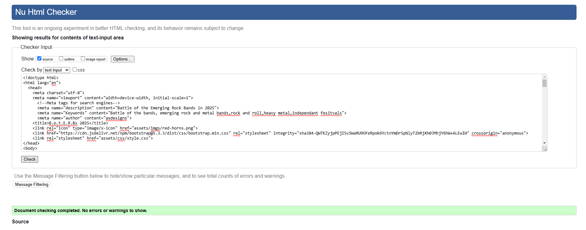  | Pass: No Errors   |
| Battle   | [W3C HTML](https://validator.w3.org/)   | 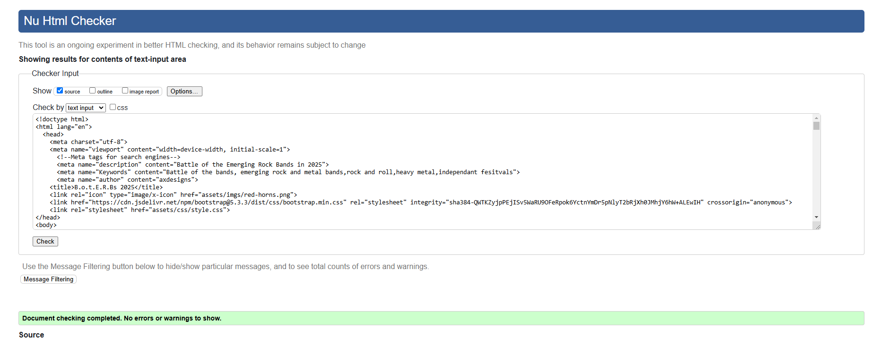   | Pass: No Errors   |
| style.css   | [W3C CSS](https://jigsaw.w3.org/css-validator/)   | 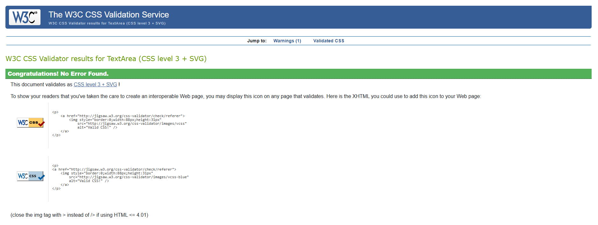   | Pass: No Errors   |

### 1.2 JavaScript Validation

For my JavaScript I used the [JShint Validator](https://jshint.com/) to validate my js files, as shown below with the corresponding screenshots, as recommended by the Code Institutes' course material:
| Page | URL | Screenshot| Notes |
|----------|----------|----------|----------|
| script.js   | [JShint](https://jshint.com/)   | 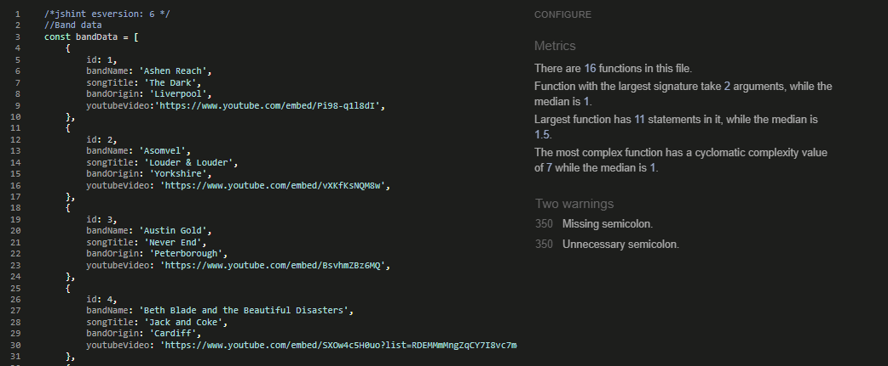   | Pass: No Errors   |

Please not the comment to change the version of JSHint was used at the top: 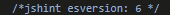

### 2. Lighthouse

 - The first run of Lighthouse gave a value of 86 for SEO and 66 for performance. To improve the SEO meta tags were added to include a description, keywords and author for search engines. This simple addition increased the performance to 91.

 - An *"Uncaught TypeError: Cannot read properties of null (reading 'addEventListener')"* was highlighted under performance which meant that JavaScript was trying to attach an event listener to an element that doesn't exist (null). At first, I thought that this was an easy fix by moving the bandData array to above the functions and moving the functions for the iframe population to below the functions for random bandData popultaion of cards. However, this did not fix the error.
  
  - What I missed was that *"document.getElementById("#go").addEventListener"click", function ()[...]"* was trying to select the elementID "#go" before it is loaded in the DOM. To fix this I wrapped the script into 'DOMContentLoaded' to ensure that the script runs only after the DOM is fully loaded. This worked.

  After running Lighthouse at the completion point of my project my index.html and my play.html pages both passed as seen below:

  #### 2.1 Lighthouse index.html

  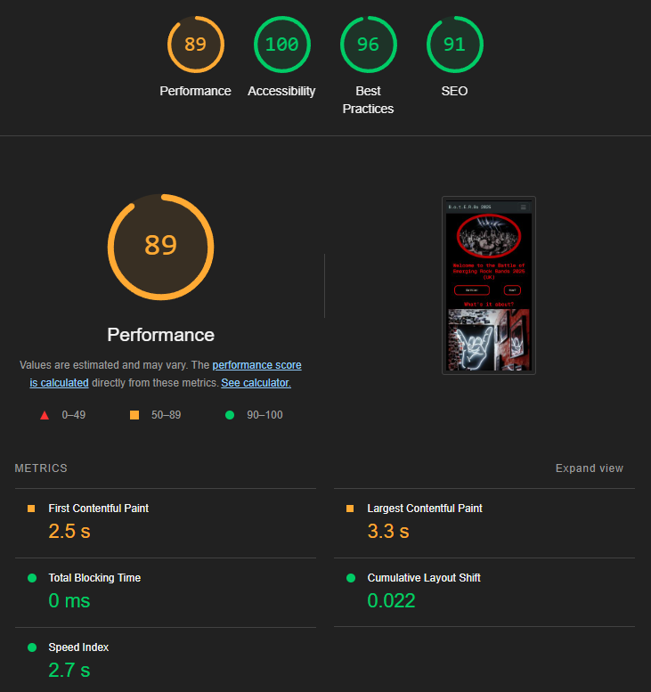

  Please see discusion around the performance score below in [Bugs Unresolved](#Lighthouse) section.

  #### 2.2 Lighthouse play.html

  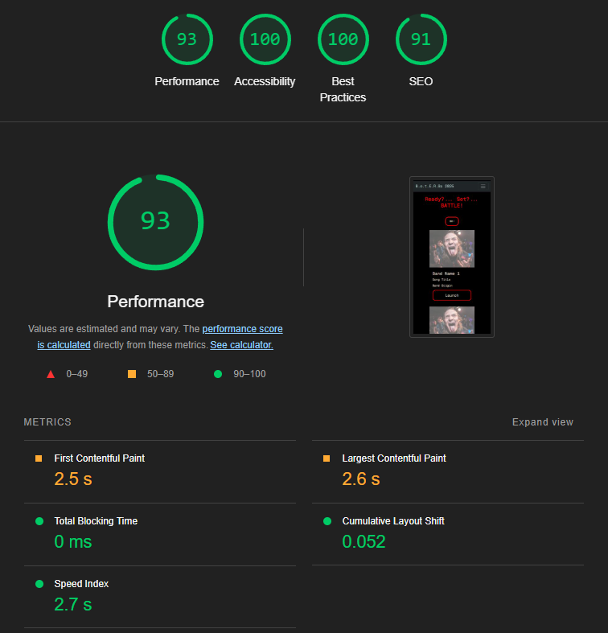

## 3. Debugging

2.1 The first bug I encountered, when live testing, was when I tried to auto populate the Battle Cards with the randomly selected band data, namely: Band Name, Song Title and Band's Origin. The first thing I did was to add console logs to the various JS functions to try and debug the error, as shown here:

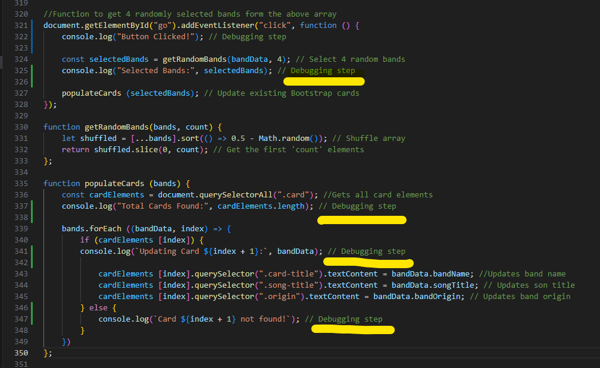

However, everything appeared to be working (see short snippet below):

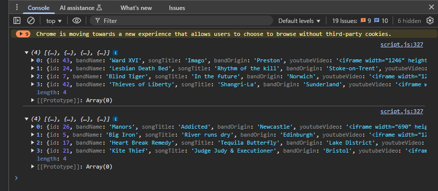

After a quick *Google* search it returned the possibility that there was an error in trying to open disabled extensions and suggested that I open the website in Incognito mode. This resolved the issue and everything worked. I deleted all my cache and cookies and didn't have the problem again.

2.2 The second major issue was trying to get the corresponding Youtube videos to play in the iframe pop-up when the Launch button was pressed.

2.3 After I had managed to append the iframe in the Battle Modal that not all Youtube videos were playing. After spending a lot of time trying to identify which videos weren't playing and tying to find different videos for the bands affected, I turned to *Google* and then later *Perplexity* to find out why they weren't playing. 

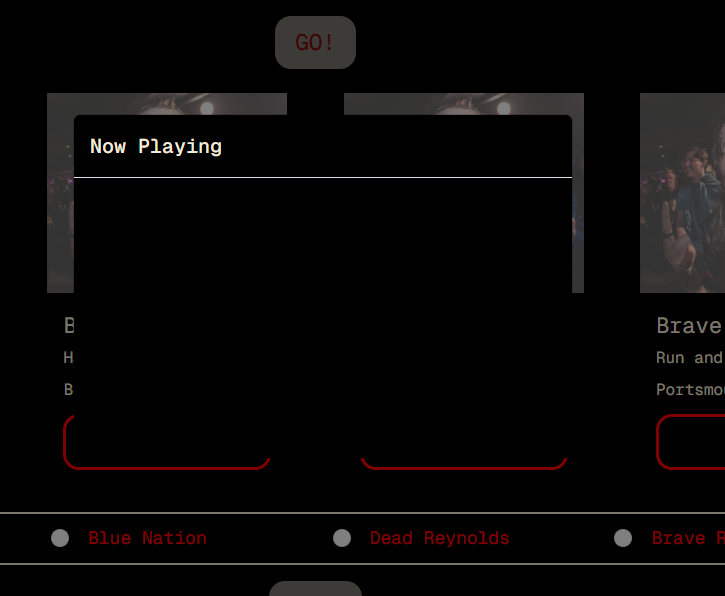

However, it was during my second meeting with my mentor that he explained to me that some bands don't like their videos embedded outside of Youtube and that they put a block on them to stop copyright infringement. This resulted in me going back to find 8 new bands that did allow their videos to be embedded and replace the ones previously identified.

Complexity was added because I had alphabetised my bandData array so I tried to replace 'similar for similar' (alphabetically) so as not have to rejig the id numbering and bandData placement in the array. This wasn’t a necessity for the functionality of the website, but I deemed it as such to satisfy my need for order and the attention to detail that it enlists.

2.4 After reviewing the comments to my first project one of the issues highlighted was the naming of my commit comments. I had a discussion with my fellow students about this and three of the group members had had the same comment. It was *Steve Powell* who mentioned that his mentor had suggested using the phrase "When applied my coment will show..." before the actual commit message to make it make sense. I also read the *GitHub* documentation around commit comments that stated that comments don't have to be in shorthand, but rather using fuller sentences and a line space to be able to list all the changes rather than only commenting on the major change.

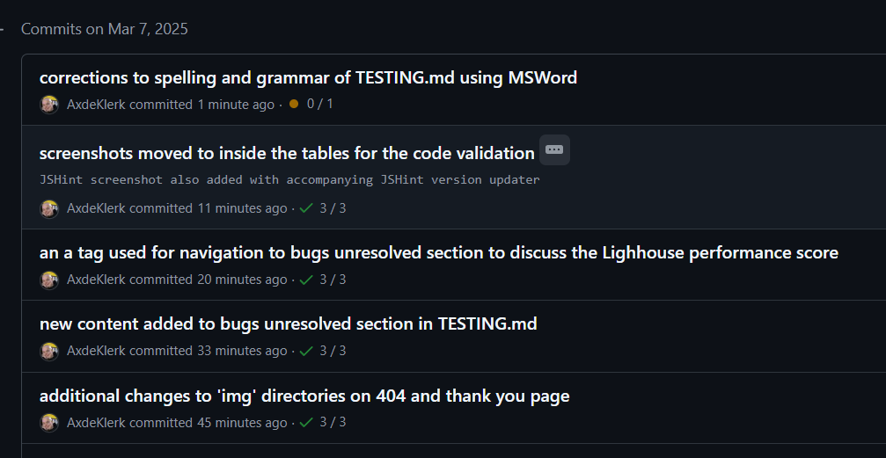

Unfortunately for this project, this only came at the end and near completion. However, the combination of both have been applied, albeit with a little error here and there while I try to get used to the new way of writing my commit messages.

Note: this list is not exhaustive, and the bugs referenced above serve merely to show the most difficult issues faced during this project. There were many smaller bugs that caused head-scratching moments but were fixed by referencing and searching *Google*, *Perplaxity*, *Chat-GBT*, *Code Institute*'s course material and the *Slack* community along with *W3C Schools*, *Bootstrap*, *GitHub* and *MDN Web* documentation.

## 3. Bugs Unresolved

3.1 Possibly, the greatest 'bug' that will always remain unresolved is my own imposter-syndrome. Having completed the course material I was left feeling like there were elements in the course that I did not understand, leaving large gaps in my learning. Following a conversation with my mentor, he suggested that the only way to learn was to tackle the subject matter 'head-on' and just keep practicing. 

Although, this was extremely good advice I still struggled with self-doubt throughout this project. To over-come this enough to complete the project I joined the Slack 'Imposter Syndrome' group. Even though I didn't contribute much due to feeling like an imposter in the group, it was encouraging to see others struggling and their coping techniques and mechanisms. 

The greatest piece of advice came from a newsletter I subscribe to by *Sahil Bloom*, where he adopted a technique given to him by a friend of his to have a 'Coaching Session' With yourself by emailing yourself and then giving yourself advise. This I practised sporadically until it became embedded into my daily routine. 

3.2 An uncaught error returned on the  Lighthouse Report for the home page due to the eventListener for the goButton that is not on the home page:

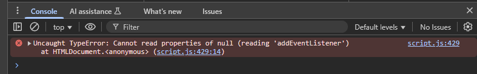

This error was first noticed when I ran the Lighthouse analyser. Unfortunately, I ran out of time to fix this due to time pressures, unavoidable family commitments and needing to submit my project on time.

3.3 The final unresolved bug was the name of my image file under my asset’s directory. During my final meeting with my mentor he stated that all my image names needed to be changed from 'imgs' to 'images' as 'imgs' is not accepted as good practice. After the meeting I went through and changed the names of all my 'imgs' to 'images', had to redo it after going back to a previous commit because of an error with my JS code that I needed to be fixed. This was only done at the time of writing this section as I had forgotten that they were also reverted when I went back to an old commit.

However, after changing all the file names to 'images' I tried to change the directory name from 'imgs' to 'images', but following message was returned:

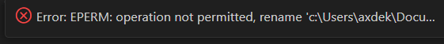

Therefore, I could not change the directory name, and it has had to remain as was.
